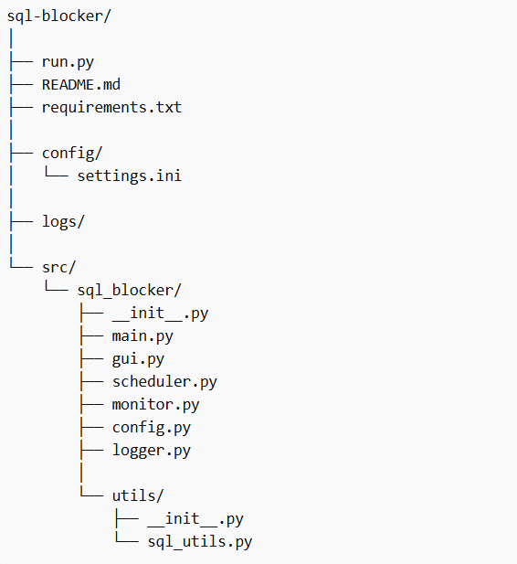

# SQL Blocker Monitor

SQL Blocker Monitor is a lightweight Python desktop application designed to automatically detect and resolve head blocking
session in Microsoft SQL Server. 

It provides a GUI interface for monitoring, configuration management, configuration management, 
and controlled automatic session termination based on configurable rules.

This tool is designed to help database administrators quickly mitigate sql blocking issues in operational environments.

## Features

- Detects head blocking sessions
- Configurable kill threshold (in seconds)
- Dry-run mode (no actual kills)
- Excluded database support
- Exempt hostname support
- Scheduled monitoring window
- GUI-based control panel
- Logging to file and live GUI console

## Project Architecture

## Component Overview

- 'run.py' - Application entry point
- 'main.py' - Initializers GUI
- 'gui.py' - User Interface
- 'scheduler.py' - Background monitoring loop
- 'monitor.py' - Core blocker detection & kill logic
- 'sql_utils.py' - SQL server database operations
- 'config.py' - Configuration management
- 'logger.py' - Logging to file and GUI

## Requirements

- Python 3.14
- Microsoft SQL Server
- ODBC Driver for SQL Server
- Python Package
  - 'pyodbc'

## Key configuration sections:

### Database
- 'conn_str' - Sql Server connection string

### Monitor
- 'kill_threshold' - Seconds before blocking SPID is eligible for kill
- 'excluded_dbs' - Comma-separated list of databases to ignore
- 'dry_run' - true or false

### Schedule
- 'start_time' - Monitoring start time (HH:MM)
- 'stop_time' - Monitoring stop time (HH:MM)

## Safety Features

- Dry-run mode for testing
- Excluded database protection
- Exempt hostname protection
- Schedule-based execution window
- Detailed logging of all actions

## AI Collaboration Tools

This project was developed with assistance from modern AI development tools to improve productivity and code quality.

### ChatGPT

Used for:
- Architecture design
- Debugging guidance
- Documentation generation
- Scheduler and monitoring logic improvements

### Github Copilot

Used for:
- Code completion
- Developer productivity

AI tools were used as assistive development aids, while design and validation were performed by the project developer.

## Code Quality Tools

This project uses automated code formatting and linting to maintain consistency.

Black - formats Pyton code automatically.
Flake8 - detects style issues and potential errors.

## Warning

This application can terminate SQL Server sessions automatically.

Improper configuration may interrupt running workloads.

Always validate behavior in a test environment before production use.

## Intended Use

This tool is designed for internal database monitoring environments where blocking sessions may impact system performance.

## Version
v1.0.0
Initial modular SQL Blocker Monitor release